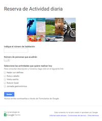
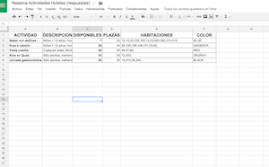
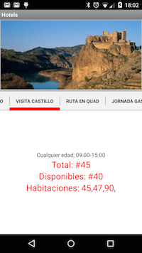

# Drive for Work backend - Hospitality (Hotel) Android app #
Drive for Work customizable apk to demonstrate hospitality use case with Google Spreadsheets and Google Forms.

The apk uses this [public form](https://docs.google.com/forms/d/1WBP8Fp-ZEQomoe0i22xTCi2wvqXUsoJILqzsRB0fT84/viewform) and this [spreadsheet as backend](https://docs.google.com/spreadsheets/d/1zQMzthur_TkahfG-8-vBWQgXJVxdT9UnhHJavRJAHhI/edit?usp=sharing), mandatory to execute the apk. 
The apk makes use of JSON download functionality of Google Spreadsheets as explained [in this video](https://www.youtube.com/watch?v=RSgMEtRl0sw). 

The spreadsheet contains one Google Apps Script project in order to download data and certain parameters, like colors.

See info on Drive for Work here: [http://www.google.com/work](http://www.google.com/work), which offers unlimited storage and advanced audit controls.

## Android Application Usage

1) Launch the apk

2) If desired, open the backend (spreadsheet) and customize text and colors.

## Workflow

1) The client fills a public form to select the hotel activity to make
2) Hotel manager can see in real time number of clients and related activities. Only hotel manager has access to the apk and the spreadsheet.

## Backend

The backend is a [Google Spreadheet](https://docs.google.com/spreadsheets/d/1zQMzthur_TkahfG-8-vBWQgXJVxdT9UnhHJavRJAHhI/edit?usp=sharing), hosted on Drive for Work.
Some information on the spreadsheet is populated through this [Google Form](https://docs.google.com/forms/d/1WBP8Fp-ZEQomoe0i22xTCi2wvqXUsoJILqzsRB0fT84/viewform) associated to the spreadsheet

## Android release

The apk can be downloaded from [here](https://drive.google.com/file/d/0B6IAELMrLfE5YkxLLTFVc2FpQTg/view?usp=sharing).
This apk uses Material Design concepts compiled with SDK target 21 (5.0) and tested on Nexus 5 with lollipop.
IDE used is Eclipse Luna

## Screenshots

